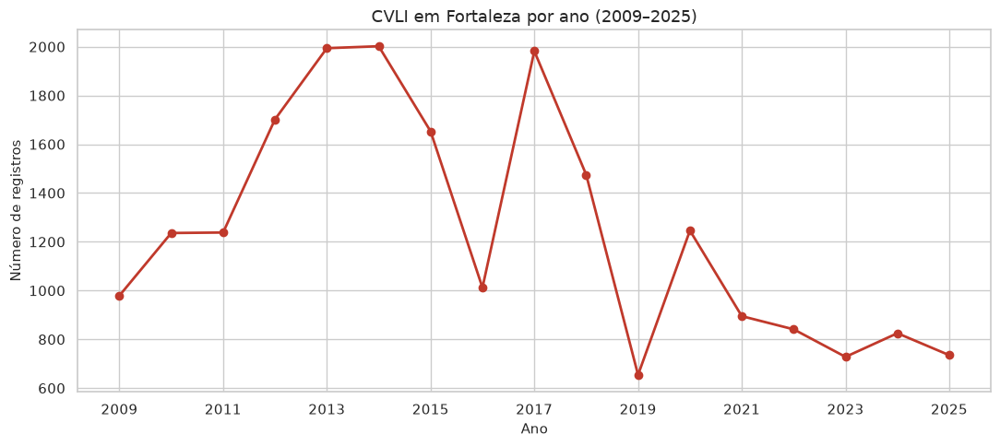
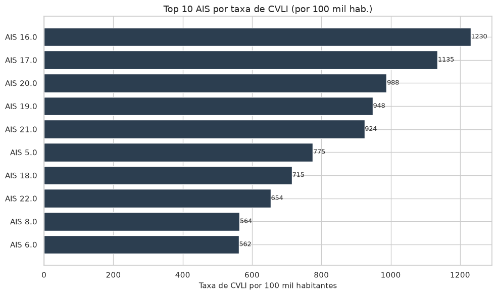
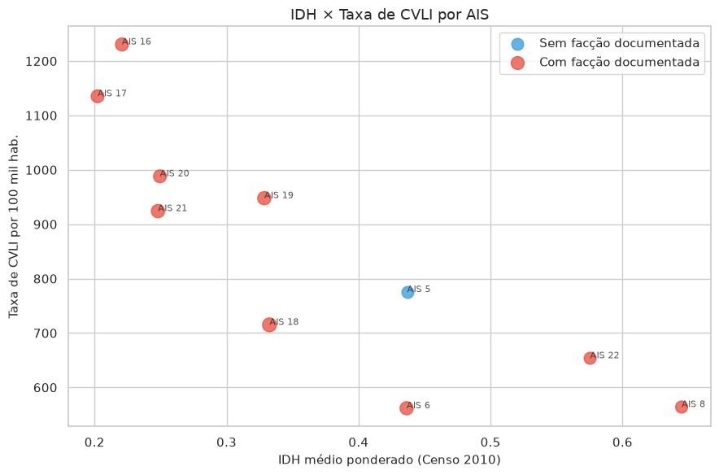
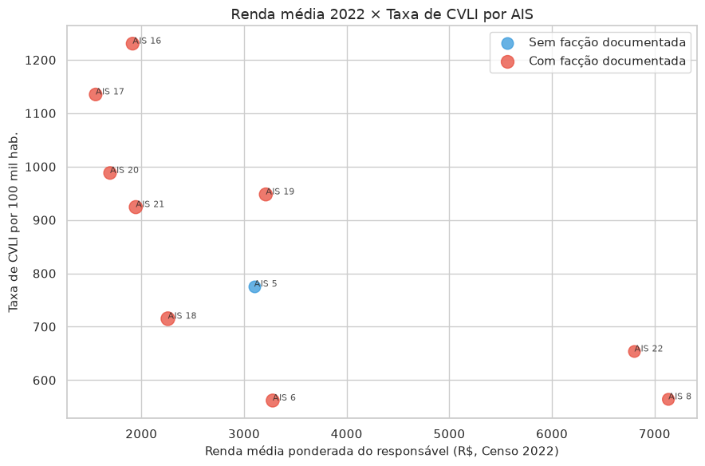
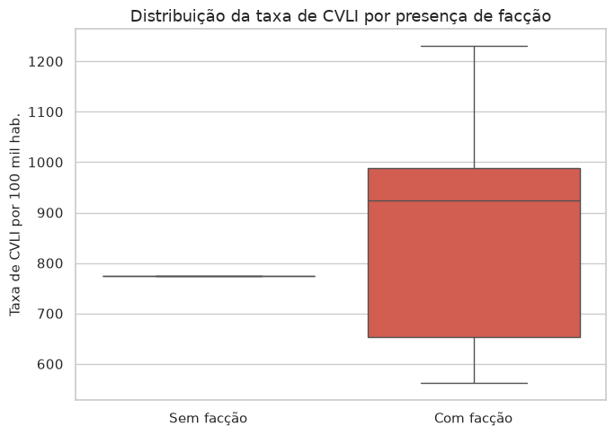
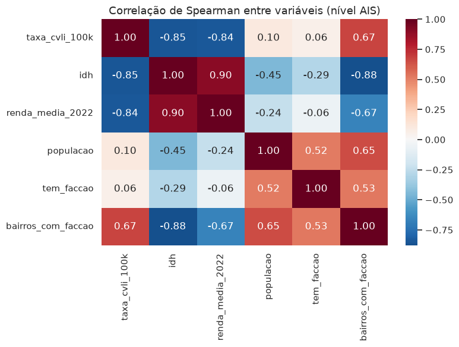
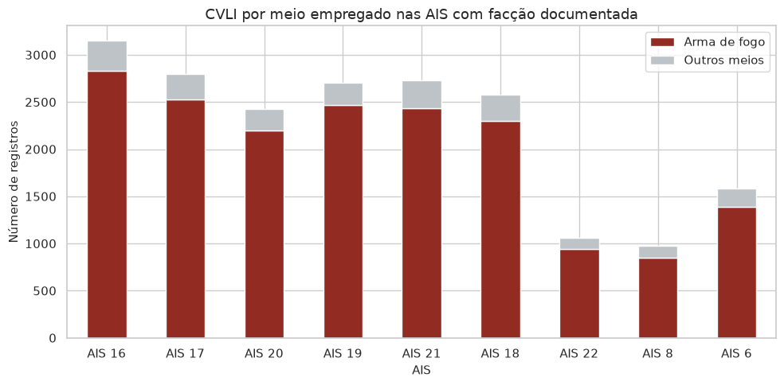

# Relação entre Crimes Violentos Letais e Intencionais, Índice de Desenvolvimento Humano, População e Presença de Facções Criminosas em Fortaleza

**Autores:** Arthur Thomé Costa, Clara Lima Silva, Mateus Rodrigues da Silva, Miguel de Lima Amaral.

**Trabalho de Estatística Aplicada** — Relatório elaborado com base no notebook `Trabalho de Estatistica Aplicada.ipynb`.

---

## Resumo

O presente estudo investiga a associação entre os índices de Crimes Violentos Letais e Intencionais (CVLI), indicadores de vulnerabilidade socioeconômica — Índice de Desenvolvimento Humano (IDH) de 2010 e renda média de 2022 — e a presença documentada de facções criminosas nas Áreas Integradas de Segurança (AIS) de Fortaleza. Foram analisados 21.197 registros de CVLI no período de 2009 a 2025, integrados a dados censitários e a uma codificação qualitativa de presença de facções em 34 bairros. Os resultados indicam concentração espacial da violência letal nas AIS periféricas de menor IDH e menor renda, com correlações negativas de Spearman entre taxa de CVLI e IDH (ρ ≈ −0,855) e entre taxa de CVLI e renda (ρ ≈ −0,842). Nove das dez AIS analisadas apresentam presença documentada de facções; contudo, o teste de Mann-Whitney não evidenciou diferença estatisticamente significativa entre as medianas das taxas de CVLI nas AIS com e sem facção (U = 5,0; p = 0,5000), em razão do desbalanceamento extremo dos grupos (9 vs. 1) e do reduzido número de unidades analíticas (n = 10). Conclui-se que os dados são compatíveis com a sobreposição entre exclusão social territorial e concentração de homicídios, sem que se possa inferir causalidade direta entre presença de facções e taxa de CVLI.

**Palavras-chave:** CVLI; violência urbana; IDH; crime organizado; Áreas Integradas de Segurança; Fortaleza.

---

## 1. Introdução

A violência letal e intencional constitui fenômeno de elevada relevância social e de saúde pública nas metrópoles brasileiras, com distribuição espacial marcadamente desigual. Em Fortaleza, capital do Ceará, os registros de Crimes Violentos Letais e Intencionais (CVLI) concentram-se de forma assimétrica no território urbano, coincidindo, em diversos recortes analíticos, com áreas de menor desenvolvimento humano e menor renda média.

Paralelamente, evidências documentadas na imprensa e em relatórios institucionais apontam para a consolidação de domínios territoriais por organizações criminosas — fenômeno frequentemente denominado *estado paralelo* —, nos quais disputas armadas, controle de rotas e imposição de normas locais podem coexistir com a precariedade socioeconômica. A compreensão da relação entre vulnerabilidade social, presença de facções e homicídios exige, portanto, a integração de bases estatísticas oficiais, indicadores censitários e codificação qualitativa de presença organizacional do crime.

Este trabalho tem por objetivo examinar, no nível das AIS de Fortaleza, a associação entre taxa de CVLI, IDH, renda média e presença documentada de facções criminosas, contribuindo para a discussão acadêmica e técnica sobre desigualdade intraurbana e violência letal na capital cearense.

---

## 2. Revisão contextual

A literatura sobre violência urbana no Brasil enfatiza a persistência de padrões territoriais de exclusão social, nos quais indicadores de desenvolvimento humano e renda funcionam como marcadores estruturais de vulnerabilidade (IPECE, 2025; PNUD, 2024). Em Fortaleza, o Informe nº 272 do IPECE evidencia ampla desigualdade de renda entre bairros no Censo de 2022, com renda média municipal variando entre R$ 1.272,25 (Genibaú) e R$ 14.775,21 (Guararapes).

No campo da segurança pública, a Secretaria da Segurança Pública e Defesa Social do Ceará (SSPDS/CE) disponibiliza séries de CVLI agregadas por AIS, unidade espacial redefinida em portarias sucessivas (SUPESP/SSPDS, 2026). A literatura e a imprensa regional têm documentado a presença de facções como Comando Vermelho (CV), Guardiões do Estado (GDE) e Terceiro Comando Puro (TCP) em bairros periféricos, embora a mensuração quantitativa dessa presença permaneça limitada por ausência de base oficial padronizada.

Diante desse cenário, a presente análise assume caráter exploratório-descritivo e inferencial, reconhecendo limitações temporais, espaciais e de causalidade que serão explicitadas na seção metodológica.

---

## 3. Metodologia

### 3.1 Pergunta de pesquisa e hipótese

**Pergunta de pesquisa:** Qual a relação entre CVLI, vulnerabilidade socioeconômica (IDH e renda) e presença de facções criminosas nas Áreas Integradas de Segurança (AIS) de Fortaleza?

**Hipótese exploratória:** Áreas com menor IDH, menor renda e maior presença documentada de facções tendem a concentrar taxas mais elevadas de CVLI.

**Objetivos específicos:**

1. Carregar, limpar e agregar os registros de CVLI (2009–2025) por ano e por AIS.
2. Integrar dados de população, IDH (2010), renda média (2022) e codificação de facções por bairro.
3. Calcular taxas de CVLI por 100 mil habitantes e realizar análises descritivas e inferenciais.
4. Avaliar correlações entre variáveis socioeconômicas, presença de facções e violência letal.
5. Interpretar os resultados à luz do fenômeno do *estado paralelo*.

### 3.2 Fontes de dados

| Fonte | Variáveis | Período / escala |
|-------|-----------|------------------|
| SSPDS/CE (`CVLI_2009-a-2025.xlsx`) | CVLI por AIS, natureza, meio empregado, perfil da vítima | 2009–2025 |
| Fortaleza Dados Abertos | IDH e população por bairro | Censo 2010 |
| IPECE Informe nº 272 | Renda média mensal do responsável pelo domicílio | Censo 2022 |
| PNUD Radar IDHM 2024 | IDHM estadual e da RMF Fortaleza | Contexto macro |
| Codificação manual (`faccoes_bairros.xlsx`) | Presença de facções (CV, GDE, TCP) | 2010–2026 |
| SUPESP/SSPDS (`ais_bairros.csv`) | Mapeamento bairro ↔ AIS | Portaria 34/2026 |

### 3.3 Tratamento dos dados de CVLI

A base original compreende **59.340** registros em todo o Ceará, dos quais **21.256** referem-se a Fortaleza em estado bruto. Após a aplicação de filtros relativos a naturezas CVLI válidas e identificação de AIS, permaneceram **21.197** registros analisáveis. Consideraram-se as naturezas homicídio doloso, roubo seguido de morte (latrocínio) e lesão corporal seguida de morte. O período analisado abrange **2009–2025**, abrangendo **10 AIS** distintas (5, 6, 8, 16, 17, 18, 19, 20, 21, 22).

**Perfil das vítimas (Fortaleza, n = 21.197):**

| Variável | Categoria predominante | Frequência |
|----------|------------------------|------------|
| Gênero | Masculino | 19.756 (93,2%) |
| Meio empregado | Arma de fogo | 18.900 (89,2%) |
| Natureza | Homicídio doloso | 20.506 (96,7%) |

### 3.4 Integração espacial

Como o CVLI é registrado por AIS — e não por bairro —, a análise espacial procedeu à agregação da seguinte forma:

- **População:** soma dos bairros pertencentes à AIS.
- **IDH e renda:** média ponderada pela população dos bairros.
- **Facções:** contagem de bairros com presença documentada; variável binária `tem_faccao`.

Foram normalizados **120–123** bairros conforme as bases de população, IDH, renda e mapeamento AIS.

### 3.5 Taxa de CVLI

  taxacvli_100k =
  
    cvlitotal
    população
  
  × 100&nbsp;000

### 3.6 Codificação de facções

Registraram-se **39 registros** em **34 bairros** com presença documentada (CV, GDE, TCP ou disputas). **9 das 10 AIS** analisadas possuem ao menos um bairro codificado; apenas a **AIS 5** (Centro) permanece sem registro. Os critérios de inclusão basearam-se em menções explícitas a domínio territorial, operações policiais ou mapeamento oficial, com consulta a fontes jornalísticas e institucionais: *O Povo*, *Diário do Nordeste*, G1 Ceará, Polícia Civil, *Folha* e Fortaleza Dados Abertos.

### 3.7 Procedimentos analíticos

Realizaram-se análises descritivas da série temporal e da distribuição espacial por AIS. No nível agregado das AIS (n = 10), calcularam-se coeficientes de correlação de Pearson e de Spearman (ρ) entre taxa de CVLI, IDH, renda, população e presença de facção. Para comparar a taxa de CVLI entre AIS com e sem facção documentada, aplicou-se o teste não paramétrico de Mann-Whitney, com hipótese alternativa de que a mediana da taxa seria maior nas AIS com facção.

### 3.8 Limitações metodológicas

- **Descompasso temporal:** IDH e população (2010) versus renda (2022) versus CVLI (até 2025).
- **Granularidade:** CVLI por AIS; IDH e renda agregados por média ponderada.
- **Fronteiras das AIS:** redefinidas em 2017 e 2026 (mapeamento da Portaria 34/2026).
- **Facções:** codificação manual e parcial; nem todo bairro foi coberto.
- **Causalidade:** correlação não implica causalidade; variáveis confundidoras são possíveis.

---

## 4. Resultados

### 4.1 Análise descritiva

#### 4.1.1 Série temporal (2009–2025)

| Ano | CVLI total | Ano | CVLI total |
|-----|------------|-----|------------|
| 2009 | 979 | 2018 | 1.475 |
| 2010 | 1.236 | 2019 | **654** |
| 2011 | 1.238 | 2020 | 1.246 |
| 2012 | 1.702 | 2021 | 895 |
| 2013 | 1.994 | 2022 | 841 |
| 2014 | **2.002** (pico) | 2023 | 728 |
| 2015 | 1.653 | 2024 | 825 |
| 2016 | 1.012 | 2025 | 735 |
| 2017 | 1.982 | | |

Entre 2009 e 2014 verificou-se crescimento sustentado do número de CVLIs; após oscilações intermediárias, destaca-se a queda abrupta em 2019 (654 casos — menor valor da série), com estabilização posterior entre 700 e 1.250 casos anuais.

#### 4.1.2 CVLI por AIS (totais acumulados, 2009–2025)

| AIS | CVLI total | Homicídios | Arma de fogo |
|-----|------------|------------|--------------|
| 16 | 3.151 | 3.075 | 2.832 |
| 17 | 2.796 | 2.733 | 2.530 |
| 21 | 2.728 | 2.642 | 2.434 |
| 19 | 2.702 | 2.640 | 2.469 |
| 18 | 2.578 | 2.479 | 2.296 |
| 20 | 2.426 | 2.362 | 2.196 |
| 6 | 1.582 | 1.490 | 1.388 |
| 5 | 1.200 | 1.123 | 962 |
| 22 | 1.061 | 1.026 | 943 |
| 8 | 973 | 936 | 850 |

#### 4.1.3 Indicadores integrados por AIS

| AIS | População | IDH (2010) | Renda média 2022 (R$) | CVLI total | Taxa /100 mil | Facção |
|-----|-----------|------------|------------------------|------------|---------------|--------|
| 16 | 256.096 | 0,221 | 1.914 | 3.151 | **1.230,4** | Sim (CV) |
| 17 | 246.309 | 0,202 | 1.554 | 2.796 | **1.135,2** | Sim (CV) |
| 20 | 245.531 | 0,250 | 1.695 | 2.426 | **988,1** | Sim (CV) |
| 19 | 285.064 | 0,329 | 3.212 | 2.702 | **947,9** | Sim (CV) |
| 21 | 295.202 | 0,248 | 1.945 | 2.728 | **924,1** | Sim (GDE/CV) |
| 5 | 154.782 | 0,437 | 3.099 | 1.200 | 775,3 | **Não** |
| 18 | 360.551 | 0,333 | 2.258 | 2.578 | 715,0 | Sim (CV) |
| 22 | 162.327 | 0,575 | 6.803 | 1.061 | 653,6 | Sim (CV) |
| 8 | 172.541 | 0,645 | 7.134 | 973 | 563,9 | Sim (CV) |
| 6 | 281.645 | 0,436 | 3.279 | 1.582 | 561,7 | Sim (CV/GDE) |

**Contexto de desigualdade intraurbana (IPECE, Censo 2022):** a renda média municipal varia entre **R$ 1.272,25** (Genibaú) e **R$ 14.775,21** (Guararapes); a mediana municipal é de **R$ 2.229,66**; cerca de **33%** da população encontra-se no 1º quartil de renda (≤ R$ 1.739,54).

**Contexto macro IDHM 2024 (PNUD):** Ceará **0,773**; RMF Fortaleza **0,796**.

### 4.2 Análise inferencial

#### 4.2.1 Correlações (nível AIS, n = 10)

| Par de variáveis | Pearson | Spearman (ρ) |
|------------------|---------|--------------|
| IDH 2010 × taxa CVLI | −0,852 | **−0,855** |
| Renda 2022 × taxa CVLI | −0,697 | **−0,842** |
| IDH 2010 × Renda 2022 | — | **+0,903** |
| População × taxa CVLI | — | ≈ +0,10 |
| Presença de facção × taxa CVLI | — | ≈ +0,06 |

#### 4.2.2 Teste de Mann-Whitney (taxa CVLI: com vs. sem facção)

- **H₁:** a mediana da taxa é maior nas AIS com facção documentada.
- **Resultado:** U = 5,0; **p = 0,5000** (não significativo).
- **Grupos:** 9 AIS com facção versus 1 AIS sem facção (AIS 5).
- **Medianas:** com facção ≈ 924/100 mil; sem facção ≈ 775/100 mil (AIS 5).

O desbalanceamento extremo dos grupos (9 vs. 1) e o reduzido número de unidades analíticas (n = 10) impedem inferências robustas quanto ao efeito isolado das facções.

### 4.3 Síntese dos achados quantitativos

1. **Concentração espacial da violência:** as cinco AIS com maiores taxas (16, 17, 20, 19 e 21) situam-se na periferia, com IDH entre 0,20 e 0,33 e renda média entre as mais baixas (ex.: AIS 17: R$ 1.554; AIS 21: R$ 1.945).

2. **Vulnerabilidade socioeconômica e CVLI:** IDH e renda correlacionam-se fortemente e negativamente com a taxa de CVLI (Spearman ≈ −0,85 e ≈ −0,84), sugerindo persistência estrutural da desigualdade territorial, apesar do intervalo de 12 anos entre IDH e renda.

3. **Facções e violência:** nove das dez AIS possuem facção documentada. A taxa média nas nove AIS com facção (~858/100 mil) supera ligeiramente a da AIS 5 (~775/100 mil), porém a diferença não é estatisticamente significativa (p ≈ 0,50).

4. **Arma de fogo:** nas nove AIS com facção, cerca de **90%** dos CVLIs envolvem arma de fogo (~20 mil registros), padrão compatível com disputas territoriais entre grupos armados.

5. **Exceções relevantes:** a **AIS 5** (Centro) apresenta taxa elevada (775/100 mil) sem registro de facção. A **AIS 6** possui facção codificada, mas taxa relativamente menor (562/100 mil). A **AIS 19** combina renda ponderada maior (R$ 3.212) com taxa ainda elevada (948/100 mil).

6. **Série temporal:** a queda abrupta em 2019 (654 casos) pode refletir mudanças metodológicas de registro, políticas de segurança ou dinâmica do crime organizado — hipóteses não confirmáveis apenas com análise descritiva.

---

## 5. Discussão

### 5.1 Série temporal de CVLI (2009–2025)

O gráfico de linha evidencia a evolução anual dos CVLIs em Fortaleza. Observa-se crescimento de aproximadamente 980 casos (2009) para mais de 2.000 (2014), seguido de oscilações e queda acentuada em 2019. Desde então, os valores estabilizam-se entre 700 e 1.250 casos anuais. A queda de 2019 recomenda investigação adicional, possivelmente relacionada a mudanças de registro ou a políticas públicas de segurança.

### 5.2 Taxa de CVLI por AIS (por 100 mil habitantes)

O gráfico de barras horizontais apresenta as dez AIS do recorte analítico. As maiores taxas concentram-se na **AIS 16** (~1.230/100 mil), **AIS 17** (~1.135/100 mil) e **AIS 20** (~988/100 mil), todas com facção documentada e IDH baixo. A **AIS 5** destaca-se com taxa elevada (~775/100 mil) sem registro de facção, indicando que elevada violência letal não se restringe exclusivamente às áreas com crime organizado codificado.

### 5.3 Associação entre IDH e taxa de CVLI

O diagrama de dispersão com ajuste de regressão linear revela associação visual entre menor IDH e maior taxa de CVLI (Pearson ≈ −0,85; Spearman ≈ −0,85). As AIS com facção concentram-se no quadrante de baixo IDH e alta violência. Registram-se exceções relevantes: AIS 6 (facção, taxa menor) e AIS 5 (sem facção, taxa elevada).

### 5.4 Associação entre renda média e taxa de CVLI

Como indicador mais recente que o IDH de 2010, a renda média reproduz o padrão de concentração da violência nas AIS de menor capacidade econômica (Spearman ≈ −0,84). Bairros como Genibaú (R$ 1.272), Bom Jardim (R$ 1.342) e Granja Lisboa (R$ 1.405) situam-se nas AIS de maior taxa. A AIS 19 constitui exceção parcial (renda R$ 3.212, taxa ~948/100 mil).

### 5.5 Distribuição da taxa de CVLI por presença de facção

A mediana nas AIS com facção (≈ 924/100 mil, n = 9) é superior à da única AIS sem facção — AIS 5 (≈ 775/100 mil). Visualmente, o padrão é compatível com a hipótese exploratória; contudo, o teste de Mann-Whitney não indica diferença significativa (p ≈ 0,50), em decorrência do desbalanceamento extremo dos grupos.

### 5.6 Matriz de correlação de Spearman

O mapa de calor confirma correlações fortemente negativas entre renda/IDH e taxa de CVLI (≈ −0,84 e ≈ −0,85) e positiva entre IDH e renda (≈ +0,90). A presença de facções correlaciona fracamente com a taxa (ρ ≈ +0,06), compatível com o fato de 9 das 10 AIS possuírem facção documentada. População e taxa mantêm correlação fraca (ρ ≈ +0,10).

### 5.7 Meio empregado nas AIS com facção

O gráfico de barras empilhadas evidencia o predomínio de arma de fogo (~90% dos CVLIs) nas nove AIS com facção documentada. Esse padrão é compatível com disputas territoriais e controle armado exercido por organizações criminosas.

### 5.8 Integração interpretativa

Os resultados convergem para um quadro de concentração da violência letal em áreas periféricas de menor desenvolvimento humano e menor renda, com forte associação estatística entre indicadores socioeconômicos e taxa de CVLI. A presença de facções reforça qualitativamente essa leitura — especialmente pelo predomínio de homicídios por arma de fogo —, mas a análise inferencial formal não permite isolar estatisticamente o efeito das facções, dado o reduzido n analítico e a quase universalidade da codificação positiva entre as AIS estudadas.

A exceção representada pela AIS 5 (Centro) sugere que dinâmicas de violência urbana não se reduzem ao domínio territorial de facções, podendo envolver outros fatores — criminalidade de oportunidade, fluxo populacional, comércio informal, entre outros — não capturados neste recorte.

---

## 6. Conclusões

A análise integrada de dados da SSPDS (CVLI), Fortaleza Dados Abertos (IDH e população de 2010), IPECE/IBGE (renda por bairro de 2022), contexto IDHM 2024 (PNUD) e codificação qualitativa de facções indica que a violência letal e intencional em Fortaleza concentra-se nas AIS de periferia com menor IDH, menor renda e com presença documentada de organizações criminosas — em especial as AIS 16, 17, 19, 20 e 21. O Comando Vermelho (AIS 17) e disputas CV/TCP (AIS 20) aparecem com destaque nas fontes consultadas.

O IDH (2010) e a renda média (2022) funcionam como indicadores complementares de vulnerabilidade social, correlacionando-se fortemente e negativamente com a taxa de CVLI (Spearman ≈ −0,85 e ≈ −0,84). A presença de facções reforça qualitativamente esse quadro: 9 de 10 AIS possuem facção documentada, ~90% dos CVLIs nessas áreas envolvem arma de fogo, e a taxa mediana é cerca de **19% superior** à da única AIS sem facção codificada (AIS 5) — embora essa diferença não atinja significância estatística formal (Mann-Whitney, p ≈ 0,50).

Em conjunto, os dados são compatíveis com as consequências do *estado paralelo* para os cidadãos fortalezenses: concentração de homicídios em áreas pobres, disputas armadas entre facções e sobreposição entre exclusão social e domínio territorial do crime organizado.

> **Observação final:** correlação não implica causalidade. Pobreza, exclusão social, políticas públicas insuficientes, mudanças nas fronteiras das AIS e possíveis vieses de registro (como a queda abrupta de 2019) podem confundir a relação observada.

---

## Referências

- SSPDS/CE. *CVLI 2009–2025*. Disponível em: https://www.sspds.ce.gov.br/
- Fortaleza Dados Abertos. *IDH e dados demográficos por bairro*. Disponível em: https://dados.fortaleza.ce.gov.br/
- IPECE. *Informe nº 272 — Renda média por bairro de Fortaleza (Censo 2022)*. Disponível em: https://www.ipece.ce.gov.br/wp-content/uploads/sites/45/2025/08/ipece_informe_272_05_ago2025.pdf
- PNUD. *Radar IDHM 2024*. Disponível em: https://www.undp.org/pt/brazil/publications/radar-idhm-evolucao-do-idhm-e-de-seus-componentes-periodo-de-2012-2024
- SUPESP/SSPDS. *Áreas Integradas de Segurança (AIS)*. Portaria 34/2026.
- Diário do Nordeste; O Povo; G1 Ceará; Polícia Civil do Ceará (matérias citadas em `dados/faccoes_bairros.xlsx`).
- IBGE. *Censo Demográfico 2010 e 2022*.

---

*Relatório elaborado com base nos outputs e interpretações do notebook `Trabalho de Estatistica Aplicada.ipynb`.*
